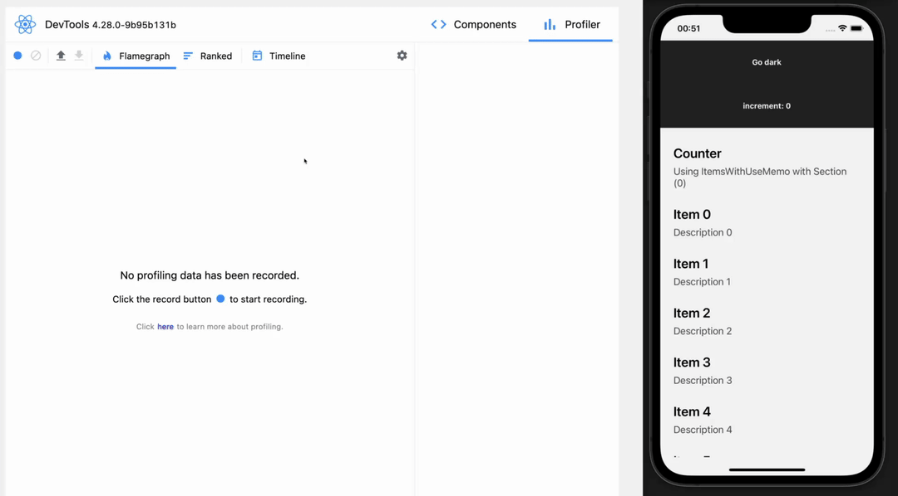
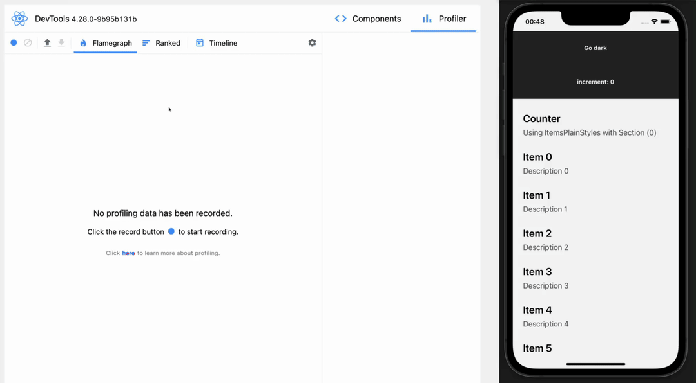
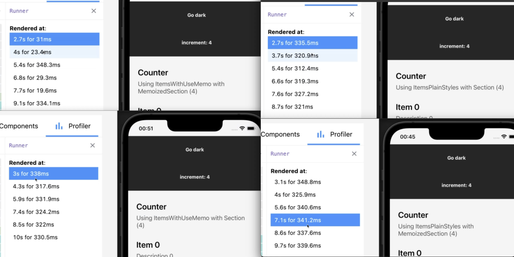

# Performance tests of `React.useMemo`

## What am I testing here?

For some time I've been using `React.useMemo(() => styleObjectOrArray, [dependencies])` to prevent a component to be re-rendered when passing a style to it.

I was wondering if it makes sense for me to keep doing this premature optimization or even if by using this, it was degrading the app performance.

To test this, I created a `<Section />` component that accepts `title`, `description`, `titleStyle` and `descriptionStyle`. It only updates when any of the props changes. Besides that, I also have the same component wrapped with `React.memo(funcion() {...})`, named as `<MemoizedSection />`.

I also have two different components that renders the `<Section />`:

- `<ItemsPlainStyle />`: that renders a single `<Section />` by passing the styles as an array of objects, which changes on every re-render.
- `<ItemsWithUseMemo />`: that, as the name suggests, renders a single `<Section />` by passing the styles as an array of objects, but this time, it uses `React.useMemo(() => style, [dependencies])`, which prevents the `<Section />` to re-render.

The main goal is to check if, by using `React.useMemo(...)` and preventing the `<Section />` to re-render, is better or worse than passing an new array of objects and letting the `<Section />` to re-renders, but not to calling the `React.useMemo(...)`.

## The results

Using the `<Section />` component:

|| [`<ItemsWithUseMemo />`](test-results/ItemsWithUseMemo-Section-increment-twice-toggle-theme-repeat-once.json) | [`<ItemsPlainStyles />`](test-results/ItemsPlainStyles-Section-increment-twice-toggle-theme-repeat-once.json)|
|:--|--:|--:|
|GIF|||
|increment 0 -> 1|338.0ms|335.5ms|
|increment 1 -> 2|317.6ms|320.9ms|
|theme dark -> light|331.9ms|312.4ms|
|increment 2 -> 3|324.2ms|319.3ms|
|increment 3 -> 4|322.0ms|327.2ms|
|theme light -> dark|330.5ms|321.0ms|
|total|2|4|

Using the `<MemoizedSection />` component:

|| [`<ItemsWithUseMemo />`](test-results/ItemsWithUseMemo-MemoizedSection-increment-twice-toggle-theme-repeat-once.json) | [`<ItemsPlainStyles />`](test-results/ItemsPlainStyles-MemoizedSection-increment-twice-toggle-theme-repeat-once.json)|
|:--|--:|--:|
|GIF|||
|increment 0 -> 1|31ms|348.8ms|
|increment 1 -> 2|23.4ms|325.9ms|
|theme dark -> light|348.3ms|340.6ms|
|increment 2 -> 3|29.3ms|341.2ms|
|increment 3 -> 4|19.6ms|337.6ms|
|theme light -> dark|334.1ms|339.6ms|
|total|5|1|

### Conclusion

The overal conclusion is that if it's rendering a few light weight components, it may be better to let them re-render and pass the plain array of objects to it. But if it's rendering multiple items (around 500), It may be better to wrap it with `React.memo(() => ...)` and use `React.useMemo(...)` hook to avoid unecessary re-renders. The same applies to cases when the component is too heavy.

### result source

